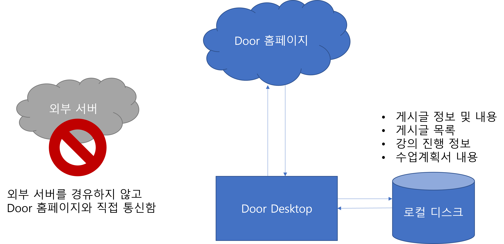
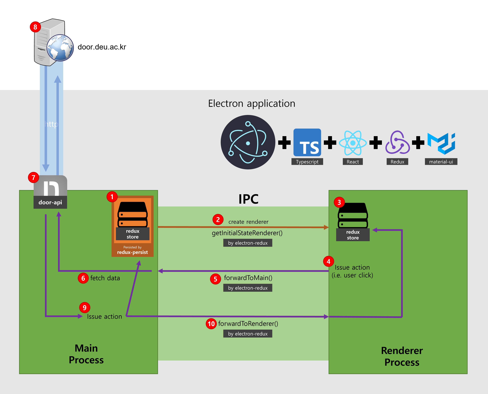

<h1 align="center">Door Desktop</h1>

Better way to join online classes, In <strong><a href="http://door.deu.ac.kr">Dong-eui University</a></strong>

  

  

<table>
<tbody>
<tr>
<td>
이 레포지토리는 GUI 소스코드만 제공하고 있습니다. door 서비스에서 데이터를 가져오는 등의 통신을 하는 코드는 제외되어 있습니다. 자세한 내용은 <a href="#5-3-프로젝트-구성">여기</a>를 참고해주세요.
</td>
</tr>
</tbody>
</table>

  

<h1>주요 기능</h1>

<h3>✨ 게시물 로딩 때문에 더 이상 스트레스 받을 필요가 없습니다.</h3>

모든 페이지들은 저장되며 굳이 긴 로딩 시간을 한번 더 기다릴 필요가 없습니다.

<h3>😥 매번 로그인으로 스트레스 받지 마세요.</h3>

자동 로그인 및 자동 로그아웃 방지 기능이 탑재되어있어 매번 아이디와 비밀번호를 입력하지 않아도 됩니다.

<h3>📲 더 나은 사용자 경험 제공</h3>

기존의 불편한 인터페이스는 잊어버리세요. Material UI로 제작된 이 애플리케이션은 최신 디자인 트렌드를 반영하였습니다.

또한 사용자 경험을 우선시하여 불필요한 동작 및 클릭을 많이 줄였습니다.

<h3>🧲 게시판마다 새 게시물을 하나하나 확인하는건 그만!</h3>

메인 화면에서 모든 게시판의 게시물을 모아서 보여줍니다.

  

<h1>다운로드 기록</h1>

-   2021년 3월 23일 **첫 릴리즈 (v0.3.4)**
-   2021년 3월 28일 **200+**

  

<h1>목차</h1>

- [1. 소개](#1-소개)
  - [1-1. 이 프로젝트는 무엇인가요?](#1-1-이-프로젝트는-무엇인가요)
  - [1-2. 왜 이런 프로젝트를 시작했나요?](#1-2-왜-이런-프로젝트를-시작했나요)
  - [1-3. 기존 Door보다 어떤 점이 더 좋나요?](#1-3-기존-door보다-어떤-점이-더-좋나요)
- [2. 설치](#2-설치)
- [3. Door 기능 지원 현황](#3-door-기능-지원-현황)
- [4. 기존 Door와 비교](#4-기존-door와-비교)
  - [4-1. 메인 화면](#4-1-메인-화면)
  - [4-2. 수업계획서 화면](#4-2-수업계획서-화면)
  - [4-3. 온라인강의 목록 화면](#4-3-온라인강의-목록-화면)
  - [4-4. 온라인강의 진행상태 화면](#4-4-온라인강의-진행상태-화면)
  - [4-5. 공지사항 게시물 목록 화면](#4-5-공지사항-게시물-목록-화면)
  - [4-6. 과제 게시물 목록 화면](#4-6-과제-게시물-목록-화면)
  - [4-7. 과제 게시물 화면](#4-7-과제-게시물-화면)
  - [4-8. 수업활동일지 게시물 목록 화면](#4-8-수업활동일지-게시물-목록-화면)
- [5. 개발자들을 위한 정보](#5-개발자들을-위한-정보)
  - [5-1. 프로젝트 테스트 또는 빌드](#5-1-프로젝트-테스트-또는-빌드)
  - [5-2. 프로젝트에 사용된 기술 스택](#5-2-프로젝트에-사용된-기술-스택)
  - [5-3. 프로젝트 구성](#5-3-프로젝트-구성)
  - [5-4. 프로그램 통신 개요](#5-4-프로그램-통신-개요)
  - [5-5. 프로그램 IPC 통신 구조](#5-5-프로그램-ipc-통신-구조)
  - [5-6. How to store password to local securely](#5-6-how-to-store-password-to-local-securely)
- [6. 체인지로그](#6-체인지로그)
  - [Door Desktop v0.0.2](#door-desktop-v002)
  - [Door Desktop v0.0.3](#door-desktop-v003)
  - [Door Desktop v0.0.4](#door-desktop-v004)
  - [Door Desktop v0.1.0](#door-desktop-v010)
  - [Door Desktop v0.1.1](#door-desktop-v011)
  - [Door Desktop v0.1.2](#door-desktop-v012)
  - [Door Desktop v0.2.0](#door-desktop-v020)
  - [Door Desktop v0.2.1](#door-desktop-v021)
  - [Door Desktop v0.2.2](#door-desktop-v022)
  - [Door Desktop v0.3.0](#door-desktop-v030)
  - [Door Desktop v0.3.1](#door-desktop-v031)
  - [Door Desktop v0.3.2](#door-desktop-v032)
  - [Door Desktop v0.3.3](#door-desktop-v033)
  - [Door Desktop v0.3.4](#door-desktop-v034)
  - [Door Desktop v0.3.5](#door-desktop-v035)
  - [Door Desktop v0.3.6](#door-desktop-v036)
  - [Door Desktop v0.3.7](#door-desktop-v037)
  - [Door Desktop v0.4.0](#door-desktop-v040)
  - [Door Desktop v0.4.1](#door-desktop-v041)
  - [Door Desktop v0.4.2](#door-desktop-v042)

  

# 1. 소개

## 1-1. 이 프로젝트는 무엇인가요?

동의대학교 Door 홈페이지의 불편한 점을 개선하는 데스크탑 앱 프로젝트입니다.

 

## 1-2. 왜 이런 프로젝트를 시작했나요?

기존의 Door 홈페이지는 매우 느립니다. 서버가 느린 것도 있지만 원하는 정보를 얻는 데 걸리는 시간도 말이죠. 사용자가 알아야 할 정보들이 여기저기 흩어져 있고, 한눈에 이해하기 힘들게 표시되어 있는 정보들이 많습니다. 사용자들이 새 게시물이 올라왔는지 확인하거나 완료하지 못한 과제가 있는지, 또 과제 마감까지 얼마나 남았는지 확인하기 위해선 곳곳에 흩어져 있는 게시물 목록들을 하나하나 클릭하여 확인해야 합니다.

이 프로젝트는 이런 불편한 점들을 개선하기 위해 시작하였습니다. 사용자 경험(UX) 측면에서, 사용자가 원하는 정보를 어떻게 적절하게 표시할 지, 또 불필요한 클릭을 어떻게 줄일 수 있을 지, 해당 정보엔 어떤 색이 적절한지 등 많은 부분을 고민하여 제작하였습니다.

  

## 1-3. 기존 Door보다 어떤 점이 더 좋나요?

**한번 열었던 게시물은 모두 저장됩니다.**

다음 번에 한번 더 클릭했을 때 빠르게 보여주기 위해서죠. 사용자 측에서 보기엔 두 번째 클릭부터 로딩시간이 아예 없는 것처럼 느껴질 겁니다.

 

**자동 로그인으로 불필요하게 로그인하는 과정을 없앴습니다.**

 

**Material UI를 채택하여 깔끔하고 직관적인 UI를 만들었습니다.**

 

**메인 화면에서 모든 게시물을 모아서 볼 수 있습니다.**

새로고침 버튼 하나면 프로그램이 각 게시판마다 게시물을 가져와 보여줍니다. 이제 새 게시물을 확인하느라 진땀빼지 않아도 되요.

 

**제출이 필요한 게시물은 제출 기한이 얼마나 남았는지 보여줘요.**

`2021년 3월 19일 23:59까지` 처럼 불편한 포맷 대신, `2일 1시간 2분 50초 남음` 같이 얼마나 남았는지를 표시해준답니다. 마우스를 올리면 기존과 같은 포맷으로 보여주기도 해요.

 

**제출 여부를 더 직관적으로.**

제출 완료한 게시물은 초록색으로 표시해줍니다. 아직 제출하지 못한 게시물은 빨간색으로 표시되니, 제출 여부를 더 직관적으로 알 수 있어요.

 

**온라인 강의, 더 직관적이고 진행 여부를 알기 쉽게!**

강의를 들으면 얼마나 들었는지 진행 바로 표시해줘요. 기존 Door 홈페이지는 별도의 페이지에 숫자로만 표시되었는데 이 프로그램에선 한 페이지에, 한 눈에 알 수 있게 표시해줘요.

 

**수업에 대한 정보, 이젠 한 눈에 바로 알 수 있어요.**

기존 Door에선 모든 정보들이 표에 똑같은 글자 크기 및 색깔로 나열되어있어서 중요한 정보가 눈에 잘 들어오지 않았어요. 이 프로그램은 유사한 정보끼리 잘 묶었으며 정보에 따라 적절한 시각화를 채택하여 더 직관적으로 이해할 수 있답니다.

  

# 2. 설치

~~이 프로젝트는 데스크탑 앱으로 제공됩니다. 현재 Windows 10 운영체제만 지원합니다.~~

~~**[Releases](https://github.com/deu-door/door-desktop/releases)** 에서 최신 버전을 확인하세요!~~

~~설치 가능한 바이너리 파일(exe 등)이 제공됩니다. 클릭하신 후 설치 진행하시면 됩니다.~~

> 학교 측의 요청으로 Release는 더 이상 제공되지 않습니다.

  

# 3. Door 기능 지원 현황

<table>
    <thead>
        <tr>
            <th>분류</th>
            <th>기능</th>
            <th>지원 여부</th>
        </tr>
    </thead>
    <tbody>
        <tr>
            <td rowspan="3">주요기능</td>
            <td>정규과정 강의</td>
            <td>O</td>
        </tr>
        <tr>
            <td>D-MOOC</td>
            <td>X</td>
        </tr>
        <tr>
            <td>쪽지</td>
            <td>X</td>
        </tr>
        <tr>
            <td rowspan="4">온라인강의</td>
            <td>수강</td>
            <td>O</td>
        </tr>
        <tr>
            <td>출석 확인</td>
            <td>O</td>
        </tr>
        <tr>
            <td>출석 기록</td>
            <td>O</td>
        </tr>
        <tr>
            <td>학습 시간 확인</td>
            <td>O</td>
        </tr>
        <tr>
            <td rowspan="1">DOOR</td>
            <td>DOOR 열람</td>
            <td>X</td>
        </tr>
        <tr>
            <td rowspan="4">수업계획서</td>
            <td>수업 정보 조회</td>
            <td>O</td>
        </tr>
        <tr>
            <td>수업 평가 방법</td>
            <td>O</td>
        </tr>
        <tr>
            <td>참여도 세부 비율 확인</td>
            <td>X</td>
        </tr>
        <tr>
            <td>주차별 강의계획</td>
            <td>X</td>
        </tr>
        <tr>
            <td rowspan="5">과제</td>
            <td>열람 및 첨부파일 다운</td>
            <td>O</td>
        </tr>
        <tr>
            <td>제출</td>
            <td>O</td>
        </tr>
        <tr>
            <td>제출기간 확인</td>
            <td>O</td>
        </tr>
        <tr>
            <td>추가 제출기간 확인</td>
            <td>O</td>
        </tr>
        <tr>
            <td>평가 정보</td>
            <td>O</td>
        </tr>
        <tr>
            <td rowspan="5">수업활동일지</td>
            <td>열람 및 첨부파일 다운</td>
            <td>O</td>
        </tr>
        <tr>
            <td>제출</td>
            <td>O</td>
        </tr>
        <tr>
            <td>제출기간 확인</td>
            <td>O</td>
        </tr>
        <tr>
            <td>추가 제출기간 확인</td>
            <td>O</td>
        </tr>
        <tr>
            <td>평가 정보</td>
            <td>O</td>
        </tr>
        <tr>
            <td rowspan="4">팀 프로젝트 결과</td>
            <td>열람 및 첨부파일 다운</td>
            <td>O</td>
        </tr>
        <tr>
            <td>제출</td>
            <td>O</td>
        </tr>
        <tr>
            <td>제출기간 확인</td>
            <td>O</td>
        </tr>
        <tr>
            <td>팀 편성 확인</td>
            <td>X</td>
        </tr>
        <tr>
            <td rowspan="2">공지사항</td>
            <td>열람 및 첨부파일 다운</td>
            <td>O</td>
        </tr>
        <tr>
            <td>읽음 여부 확인</td>
            <td>O</td>
        </tr>
        <tr>
            <td rowspan="2">강의자료</td>
            <td>열람 및 첨부파일 다운</td>
            <td>O</td>
        </tr>
        <tr>
            <td>읽음 여부 확인</td>
            <td>O</td>
        </tr>
        <tr>
            <td rowspan="6">기타</td>
            <td>퀴즈</td>
            <td>X</td>
        </tr>
        <tr>
            <td>토론</td>
            <td>X</td>
        </tr>
        <tr>
            <td>Q&A</td>
            <td>X</td>
        </tr>
        <tr>
            <td>1:1 교수 상담</td>
            <td>X</td>
        </tr>
        <tr>
            <td>팀별 게시판</td>
            <td>X</td>
        </tr>
        <tr>
            <td>멘토링 게시판</td>
            <td>X</td>
        </tr>
    </tbody>
</table>

  

# 4. 기존 Door와 비교

## 4-1. 메인 화면

|                 기존 Door                  |                   Door Desktop                    |
| :----------------------------------------: | :-----------------------------------------------: |
|  |  |

 

## 4-2. 수업계획서 화면

|                    기존 Door                     |                     Door Desktop                      |
| :----------------------------------------------: | :---------------------------------------------------: |
|  |  |

 

## 4-3. 온라인강의 목록 화면

|                  기존 Door                  |                   Door Desktop                   |
| :-----------------------------------------: | :----------------------------------------------: |
|  |  |

 

## 4-4. 온라인강의 진행상태 화면

|                      기존 Door                      |         Door Desktop          |
| :-------------------------------------------------: | :---------------------------: |
|  | 온라인강의 목록 화면에 통합됨 |

 

## 4-5. 공지사항 게시물 목록 화면

|                 기존 Door                  |                  Door Desktop                   |
| :----------------------------------------: | :---------------------------------------------: |
|  |  |

 

## 4-6. 과제 게시물 목록 화면

|                   기존 Door                    |                    Door Desktop                     |
| :--------------------------------------------: | :-------------------------------------------------: |
|  |  |

 

## 4-7. 과제 게시물 화면

|                      기존 Door                       |                       Door Desktop                        |
| :--------------------------------------------------: | :-------------------------------------------------------: |
|  |  |

 

## 4-8. 수업활동일지 게시물 목록 화면

|                   기존 Door                   |                    Door Desktop                    |
| :-------------------------------------------: | :------------------------------------------------: |
|  |  |

  

# 5. 개발자들을 위한 정보

## 5-1. 프로젝트 테스트 또는 빌드

이 프로젝트는 `yarn` 패키지 관리자를 사용하고 있습니다. 테스팅 및 빌드, 패키징은 `electron-forge` 를 사용합니다.

-   **`yarn start`**
    -   즉석으로 테스트하는 스크립트입니다. `electron-forge start --inspect-electron` 명령어가 실행되며, Hot Reload가 적용되어 테스트 중에 소스코드를 수정하면 즉석으로 반영됩니다.
    -   main process는 chrome에서 `chrome://inspect` 를 통해 DevTools를 사용할 수 있습니다. 자세한 내용은 [https://www.electronjs.org/docs/tutorial/debugging-main-process](https://www.electronjs.org/docs/tutorial/debugging-main-process1) 를 참고해주세요.
-   **`yarn package`**
    -   소스코드를 실행 가능한 바이너리 파일(예: .exe)을 빌드하는 스크립트입니다.
-   **`yarn make`**
    -   설치 가능한 파일을 생성하는 스크립트입니다.
-   **`yarn lint`**
    -   eslint 및 prettier를 실행하여 문법과 코드 스타일을 검사합니다.

 

## 5-2. 프로젝트에 사용된 기술 스택

**[Electron](https://www.electronjs.org/)**

웹을 데스크탑 앱으로 만들어 주는 라이브러리입니다.

**[Typescript](https://www.typescriptlang.org/)**

Javacript에 강력한 타입 검사가 추가된 언어입니다. 중/대규모 프로젝트에서 실수를 많이 줄여주며 개발 기간 단축에 큰 도움이 되었습니다.

**[React](https://reactjs.org/)**

복잡한 상태 관리를 편리하게 할 수 있는 프레임워크. 중구난방이 될 수도 있는 상태 관리를 React 덕분에 깔끔하게 할 수 있었습니다.

**[Redux](https://redux.js.org/)**

종합적인 상태 관리를 도와주는 라이브러리입니다. 주로 `Redux toolkit` 을 사용하여 상태를 관리하였습니다.

**[Material UI](https://material-ui.com/)**

Google Material Design이 적용된UI 컴포넌트들을 제공해주는 라이브러리입니다. 덕분에 깔끔한 UI를 만들 수 있었습니다.

 

## 5-3. 프로젝트 구성

`Door Desktop` 프로젝트는 [http://door.deu.ac.kr](http://door.deu.ac.kr) 과 통신하여 로그인, 로그아웃 그리고 데이터를 파싱하는 `door-api` 레포지토리와, UI 출력을 담당하는 `door-desktop` 레포지토리로 구성되어 있습니다.

학교 측에선 소스코드의 악용을 우려하여 `door-api` 레포지토리는 GitHub에서 비공개로 전환되었습니다. 따라서 UI 파트인 `door-desktop` 레포지토리만 공개가 되어있습니다.

현재 `door-api` 모듈이 제거되어 있는 상태이므로 이 레포지토리의 소스코드만 사용하여 `Door Desktop` 앱을 빌드할 수 없습니다.

 

## 5-4. 프로그램 통신 개요

이 프로그램은 별도의 외부 서버와 통신하지 않습니다. 오로지 공식 Door 홈페이지와 통신하며, 데이터는 로컬 디스크에 저장됩니다. 따라서 사용자의 데이터가 외부로 유출될 위험이 없습니다.

> Door 홈페이지 이외에 프로그램 구동에 필요한 데이터를 불러오기 위해 GitHub와 통신할 수도 있습니다. 단, 사용자 데이터를 전송하지는 않습니다.

 

## 5-5. 프로그램 IPC 통신 구조

이 섹션에서는 프로그램의 IPC (Inter-Process Communication) 통신 구조에 대해 설명합니다.

1. 프로그램이 켜지면 Main Process 의 redux store 가 초기화됩니다. Main Process 의 redux store 는 `redux-persist` 가 적용되어 있어 프로그램이 꺼질 때 상태가 저장되며, 켜질 때 저장되어 있는 상태를 불러옵니다.
2. Main Process 가 준비되면 Renderer Process 를 생성합니다. Renderer Process 는 chromium 으로 작동하며 이는 `electron` 의 핵심이라 할 수 있습니다. Renderer Process 또한 별도의 redux store 를 가지고 있습니다. Main Process 와 동일한 redux store 를 가지기 위해 Renderer Process 생성과 동시에 `getInitialStateRenderer()` 를 통하여 Main Process 의 redux store 데이터를 복사하여 가져옵니다.
3. Renderer Process 의 redux store 가 준비가 완료되면 UI를 초기화하여 창을 띄웁니다.
4. 사용자가 프로그램을 사용하면서 클릭 등의 이벤트(게시물 클릭, 게시물 목록 불러오기 등)가 발생하면 Renderer Process 에서 action 을 발행합니다. 이 때, action 은 실질적으로 데이터를 가져오는(fetch) 역할을 수행하지 않습니다. 오로지 Main Process 에 `fetch` 를 요청하는 용도로 사용됩니다.
5. Renderer Process 에서 발행된 action 은 IPC를 통해 Main Process 로 전달됩니다.
6. Main Process 는 action 을 받고 fetch할 데이터를 해석합니다.
7. Main Process 의 요구에 따라 `door-api` 모듈은 http://door.deu.ac.kr 사이트에 데이터를 요청합니다.
8. Door 사이트에선 `door-api` 의 요청에 따라 데이터(`html`)를 반환합니다. `door-api` 는 해당 `html` 을 파싱하여 `Javascript Object` 로 가공합니다.
9. `door-api`를 통해 받은 데이터를 redux store 에 전달할 수 있도록 action 으로 발행합니다. 이는 Main Process, Renderer Process 둘 다 전달됩니다. 동일한 action 을 모든 Process 에 broadcast 함으로서, Process 마다 가지고 있는 redux store 를 동일한 상태로 유지할 수 있습니다.
10. Main Process 에서 Renderer Process 로 action 을 전달할 때 `forwardToRenderer` 를 통해 전달됩니다. `forwardToMain` 의 반대입니다.

 

## 5-6. How to store password to local securely

This section describes about "how to securely save user's credential to local storage". Please note, how this logic is secure is depends on `OS keychain` system.

Once user checked `auto-login`, program encrypts password with symmetric encryption algorithm: `AES-256-CBC`. Encrypted password is splited to two parts, `key with iv` and `encrypted password by algorithm`. The former is stored in the `OS keychain` and latter is stored in the `AppData`. Delete either of them, it cannot be decrypted.

  

# 6. 체인지로그

## Door Desktop v0.0.2

<h3>Feature Changelog</h3>

-   로그아웃 기능 추가
-   캐시 간주 기간 30분에서 1시간으로 변경
-   타임라인 페이지에서 컨텐츠의 캐시 간주 기간이 지났는지 확인 후 지났다면 업데이트

<h3>Bug Fix</h3>

-   유튜브 영상의 재생, 탐색 등의 컨트롤러가 이제 정상적으로 보임

 

## Door Desktop v0.0.3

<h3>Feature Changelog</h3>

-   자동 로그아웃 방지 기능 추가
-   이제 대시보드에서 타임라인이 표시되지 않고 강의마다 표시됨
-   강의의 대시보드 탭에서 공지사항, 과제 등 게시물 목록의 최신 상태를 확인하는 기능 추가
-   백그라운드에서 천천히 게시물 목록을 가져오는 기능 삭제
-   게시물을 생성된 시각 기준으로 오름차순으로 정렬하도록 수정

<h3>Bug Fix</h3>

-   몇몇 디자인 오류 수정

 

## Door Desktop v0.0.4

<h3>Feature Changelog</h3>

-   윈도우 툴바 제거

<h3>Bug Fix</h3>

-   글 내용이 로드되지 않았음에도 글의 일부 컴포넌트가 보이던 점 수정

 

## Door Desktop v0.1.0

<h3>Feature Changelog</h3>

-   수업활동일지, 팀 프로젝트 게시판 구현
-   사용자 프로필 이미지가 보이도록 수정됨
-   처음 열었을 때 창의 크기를 좀 더 크게 표시하도록 수정
-   채팅 로직 구현(실험적)

<h3>Bug Fix</h3>

-   SameSite=Lax 정책이 우회되지 않는 오류 수정

<h3>Code Changelog</h3>

-   컴포넌트 및 비즈니스 로직 재구성 및 리팩토링
-   개발 환경에서 메뉴 바를 제거하지 않도록 설정

 

## Door Desktop v0.1.1

<h3>Feature Changelog</h3>

-   다크모드 지원
-   파일 업로드 구현. 파일 업로드를 사용하는 게시판(과제, 수업활동일지, 팀 프로젝트)에서 사용 가능
-   수업활동일지와 팀 프로젝트 최신 게시물을 대시보드에서도 받아오게끔 수정
-   상단 AppBar 색깔이 파랑에서 흰색으로 변경됨

<h3>Bug Fix</h3>

-   아직 과제 기간에 해당되지 않는 게시물을 읽어올 때 발생하는 에러 수정

<h3>Code Changelog</h3>

-   이미 요청중인 자원에 대해 이중으로 요청되지 않게끔 수정
-   크기가 커진 PostComponent 내 마이크로 컴포넌트를 개별 파일로 분리
-   Stomp React 컴포넌트를 Typescript 모듈로 직접 구현하여 사용

 

## Door Desktop v0.1.2

<h3>Feature Changelog</h3>

-   게시물의 제목 폰트 크기 더 작게 조정
-   메인 화면(임시)의 폰트 크기를 좀 더 작게 조정
-   강의 목록에서 주별로 등록된 강의가 몇 개인지 표시됨

<h3>Bug Fix</h3>

-   간혹 게시물 로딩 상태가 로딩중으로 계속 멈출 수 있는 오류 수정

<h3>Code Changelog</h3>

-   아이콘 리소스 사이즈별로 추가

 

## Door Desktop v0.2.0

<h3>Feature Changelog</h3>

-   게시물의 새로고침 버튼을 맨 하단이 아닌 상단에 배치
-   게시물의 새로고침 버튼 디자인 버튼 스타일에서 링크 스타일로 변경
-   강의 게시물에 새로고침 버튼 추가
-   제출 가능한 게시물에 제출 기한 및 만료 상태를 표시

<h3>Bug Fix</h3>

-   게시물 목록을 가져올 때 게시물 목록에 있는 일부 정보들이 무시되던 버그 수정
-   대시보드 상에서 모든 게시물을 최신 상태로 새로고침할 때 발생하는 에러를 일부 보여주지 않던 오류 수정
-   게시물의 불필요한 여백(margin)을 제거

<h3>Code Changelog</h3>

-   Post 관련 컴포넌트 및 클래스 리팩토링
-   학습현황을 불러오는 기능 구현. UI는 아직 미구현된 상태

 

## Door Desktop v0.2.1

<h3>Bug Fix</h3>

-   처음 윈도우 창이 켜질 때 door-desktop로 표시되는 버그 수정

<h3>Code Changelog</h3>

-   채팅 접속 시 localhost:8000으로 설정되어있던 것을 실제 도메인(door.p-e.kr)으로 변경

 

## Door Desktop v0.2.2

<h3>Bug Fix</h3>

-   공지사항의 게시물이 표시되지 않던 버그 수정

 

## Door Desktop v0.3.0

<h3>Feature Changelog</h3>

-   UI/UX를 모두 새로 바꾸었음, 사용자 경험을 한층 더 강화
-   채팅 기능 지원 종료
-   학기 선택 기능 추가
-   처음 로그인 시 데이터를 미리 받아놓는 과정을 제거
-   온라인 강의 게시판 지원
-   프로그램 제거 시 AppData 폴더도 제거하도록 설정
-   ... 기타 등등 셀 수 없이 많은 부분이 변경됨!!

<h3>Code Changelog</h3>

-   코드의 90%를 리팩토링
-   Redux toolkit 사용
-   Custom hooks 추가

 

## Door Desktop v0.3.1

<h3>Feature Changelog</h3>

-   메인 화면에서 선택된 학기에 대한 대시보드 추가
-   메인 화면의 대시보드에 시간표 추가. 특정 시간 선택 시 하이라이트 되며 해당 시간에 해당되는 게시물만 볼 수 있음
-   게시물 목록을 표시할 때 제한된 크기만큼 표시됨, 더보기 버튼을 눌러 더 많이 표시할 수 있음
-   공지사항/강의자료 게시물에 대해 읽음 여부를 확인할 수 있는 기능 추가
-   로그인 상태 유지 체크 시 공공장소 사용에 대한 경고 추가
-   자동 로그인을 로그인 상태 유지로 이름을 바꿈
-   광고 영역을 추가함. 추후 동아리 및 교내 행사에 대한 수요가 있을 시 활용될 예정. 없다면 제거
-   상단 바 유저 아이콘을 왼쪽에서 오른쪽으로 이동
-   상단 바에 학번 대신 전공을 표시하도록 변경
-   간단한 Footer를 추가함

<h3>Bug Fix</h3>

-   학기 선택에 대한 잘못된 동작 수정
-   팀 프로젝트 게시물이 불러와지지 않던 오류 수정
-   스크롤 바 표시 오류 수정

 

## Door Desktop v0.3.2

<h3>Feature Changelog</h3>

-   새로운 0.3.x 버전에 맞춰 README 업데이트
-   시간표 및 공지사항/강의자료 컴포넌트를 위로, 과제/수업활동일지/팀 프로젝트 컴포넌트를 아래로 위치를 변경하였음
-   추가 제출기간을 표시함
-   제출한 첨부파일을 삭제하기 전 삭제 confirm 메세지를 띄우도록 수정 (이전엔 바로 삭제되었음)
-   제출 기한에 해당되지 않을 시 제출 기한 텍스트를 살짝 투명하게 처리
-   온라인강의 화면에서 강의 제목들의 크기를 좀 더 작게 수정
-   온라인강의 화면에서 진행 바의 크기를 더 작게 수정
-   온라인강의 화면에서 진행 바의 색깔에 Gradient를 추가하였음
-   상단 네비게이션 바에서 사용자의 이름 첫 글자 대신 유저 아이콘을 표시
-   heading 폰트는 NanumSquare로, subtitle, body 폰트는 NanumSquareRound로 지정

<h3>Bug Fix</h3>

-   외부 링크를 클릭했을 때 외부 브라우저에서 열리도록 수정
-   다크 모드에서 몇몇 컴포넌트의 색이 이상하던 점 수정(시간표와 읽지 않은 게시물)
-   제출 마감까지 남은 기간이 음수 값을 보이는 버그 수정
-   NanumSquare, NanumSquareRound 폰트가 제대로 로드되지 않던 버그 수정
-   TimeTable에서 잘못된 태그 이름 수정(thead td -> thead th)
-   창의 크기를 줄였을 때 메인화면에서 게시물 목록의 크기가 이상하게 보이던 버그 수정

<h3>Code Changelog</h3>

-   대시보드에서 여러 게시판의 게시물을 긁어오는 로직 수정(컴포넌트가 destruct될 때 바로 중단되도록 함)
-   appx 아이콘과 타일 이미지 추가

 

## Door Desktop v0.3.3

<h3>Feature Changelog</h3>

-   자동 업데이트 지원. GitHub releases를 통해 업데이트를 수신함.

<h3>Bug Fix</h3>

-   메인 화면에서 시간표의 상단 헤더 부분의 배경이 투명하던 오류 수정
-   메인 화면에서 여러 게시판의 게시물을 로드할 때 시간표의 항목을 선택하면 멈추던 현상 수정

<h3>Code Changelog</h3>

-   KeepLatestState 컴포넌트는 이제 visibility에 의존하지 않음. (기존: 컴포넌트가 화면 상에 표시될 때에만 Fetch됨)
-   appx 아이콘의 로고 크기를 조금씩 작게 수정
-   icon, tiles 리소스를 별도 repository로 이동(deu-door/door-desktop-resources), submodule로 연결
-   Artifact 포맷을 door-desktop-${version}-setup-${arch}.${ext} 로 변경
-   package.json에 몇몇 scripts 추가

 

## Door Desktop v0.3.4

<h3>Feature Changelog</h3>

-   메인 화면의 Footer에서 외부 링크(카카오 오픈채팅방) 표시. door-desktop-online-resources 레포지토리에서 받아옴
-   메인 화면의 splash text를 door-desktop-online-resources에서 받아오도록 수정

<h3>Code Changelog</h3>

-   Google Analytics 태그 추가

 

## Door Desktop v0.3.5

<h3>Feature Changelog</h3>

-   메인 화면에서 게시물들이 언제 새로고침되었는지 보이게끔 수정
-   메인 화면의 종합 게시글 목록에서 게시글 타입(공지사항/강의자료 등) 필터 체크박스 추가
-   타이틀바에 색깔을 입힘
-   로그인 페이지를 좀 더 미려하게 수정
-   창의 크기가 작을 때(<768px) 왼쪽 사이드 바 크기를 작게 조정하도록 수정
-   유저 정보에서 유저의 사진을 띄우도록 수정
-   로그인 페이지에서 패스워드 입력 시 CapsLock이 켜져있는 경우 경고 문구 추가
-   제출을 편집하기 전 첨부파일 삭제 버튼을 표시하지 않도록 수정
-   온라인강의에서 출석 여부도 같이 새로고침되게끔 수정
-   자동 로그인 미사용 시 데이터를 보존하지 않도록 변경
-   서버와 연결할 수 없거나 로그인이 끊어질 시 상단에 DISCONNECTED를 표시하게끔 수정(클릭 시 다시 로그인 시도)
-   상단 바에서 Login이라는 모호한 의미의 텍스트를 표시하지 않도록 수정
-   실험 기능: Offline Access 추가. 자동 로그인 사용시에만 작동하며 Door 서버가 다운되거나 네트워크에 연결되어 있지 않을 때에도 미리 저장해 둔 데이터를 볼 수 있음.

<h3>Bug Fix</h3>

-   첨부파일 다운로드 후 간혹 "열기" 버튼이 클릭이 안되던 오류 수정
-   첨부파일 다운로드 시 "열기" 버튼이 왼쪽 아래에 뜨던 오류 수정. 이제 오른쪽에 뜸
-   제출 날짜를 표시할 때 오전/오후가 표시되지 않던 오류 수정
-   로그아웃 시 데이터를 비우도록 수정
-   외부 링크 사이에 간격이 없던 오류 수정
-   상단 바에서 로그인 상태가 잘 감지되지 않던 오류 수정
-   로그인 실패 시 잘못된 경로로 라우팅되는 동작 수정
-   온라인강의가 잘못된 방식으로 저장되던 오류 수정

<h3>Code Changelog</h3>

-   UserDialog를 별도 파일로 분리(source: Navigator.tsx)
-   TermPostList를 별도 파일로 분리(source: TermDashboard.tsx)
-   메인 화면에서 상단과 하단 여백 조정
-   loginWithSavedCredential 액션은 내부에서 login api를 호출하는 대신 login 액션을 dispatch하도록 변경
-   Google Analytics 태그 제거
-   비밀번호가 틀려 로그인 실패 시 저장된 비밀번호를 지우도록 변경

 

## Door Desktop v0.3.6

<h3>Feature Changelog</h3>

-   메인화면 하단의 제출 게시글 모음을 3->8개씩 표시하도록 수정
-   메인화면 하단의 제출 게시글 모음의 정렬 로직 수정. 빨리 제출해야 하는 게시글을 우선으로 표시함
-   수업활동일지 게시판에 올라오는 팀 프로젝트 게시글을 표시하도록 수정. (팀 프로젝트 카테고리에 표시됨)
-   메인화면의 배너에 프로그램의 버전이 표시되며 또한 비공개 버전임을 명시함
-   상단 바에서 Door Desktop 글자를 제거함 (Mac에서 창 컨트롤 버튼과 겹치기 때문)

<h3>Bug Fix</h3>

-   Mac OS에서 http 사용으로 인해 로그인이 안되는 오류 수정

<h3>Code Changelog</h3>

-   npm 패키지 버전 업그레이드
-   electron-is-dev, electron-reload 패키지 삭제
-   AJAX 요청 시 5000ms timeout 옵션을 주도록 설정
-   개발자 도구(DevTools)를 열 수 있도록 수정
-   Mac OS 빌드 지원

 

## Door Desktop v0.3.7

<h3>Bug Fix</h3>

-   2021-05-25 Door 홈페이지 잠수함 패치로 인해 학습 현황을 제대로 불러오지 못하던 점 수정
-   Mac OS에서 Cmd+w 입력 시 창이 종료되도록 수정

<h3>Code Changelog</h3>

-   React 버전 16에서 17로 업그레이드
-   React.StrictMode 사용

 

## Door Desktop v0.4.0

<h3>Feature Changelog</h3>

-   대시보드에 강의 진행 현황 컴포넌트를 추가하였음. 이제 강의 진행을 한 눈에 확인할 수 있음
-   게시글의 조회수, 카테고리를 표시할 때 아이콘을 적극적으로 활용하였음
-   게시글 목록에서 작성 시간은 오른쪽 하단으로 배치되도록 하였음
-   상단 AppBar에 있던 유저 프로필을 SideBar로 옮겼음
-   게시물 리스트를 최신화하는 컴포넌트를 추가하였음
-   다크모드에서 일부 컴포넌트의 시인성이 떨어지던 점 수정

<h3>Bug Fix</h3>

-   대시보드에서 게시물 목록을 최신화하는 중에 다른 뷰로 이동할 시 멈추던 버그 수정
-   NanumSquare, NanumSquareRound 폰트가 제대로 적용되지 않던 버그 수정
-   다운로드와 관련된 버그 수정 및 안정성 개선
-   ...그 외 수많은 버그들을 고쳤음

<h3>Code Changelog</h3>

-   Renderer Process에서 처리되던 대부분의 로직을 Main Process로 이전하였음
-   백그라운드 로직이 Renderer Process에서 Main Process로 옮겨짐에 따라 프로그램 안정성 증가, 백그라운드 작업을 구현할 수 있는 기반을 마련
-   React Component들을 리팩토링하였음. 이제 컴포넌트들은 Desktop이라는 접두사를 가짐
-   electron-redux를 도입하여 Main과 Renderer간 상태가 동기화될 수 있도록 적용하였음
-   electron, React 등 의존성들의 버전을 최신으로 업데이트하였음
-   electron remote 모듈의 코드를 최대한 줄였음. (Renderer -> Main 으로 IPC 통신하는 것으로 변경)
-   electron-forge, webpack 을 도입
-   Splash 창을 도입하였음. 초기에 프로그램을 켤 때 Splash 화면이 띄워짐
-   door 홈페이지와 통신하는 코드 및 관련 Typescript definition들을 door-api 로 분리하였음
-   ...그 외 수많은 부분들을 리팩토링 하였음

<h3>Known Issue</h3>

-   과제 제출이 정상 작동하지 않음

 

## Door Desktop v0.4.1

<h3>Feature Changelog</h3>

-   다운로드 시 파일 크기를 소숫점 2자리까지 표시하도록 수정

<h3>Bug Fix</h3>

-   **deu-door/door-api@4ab84cbb194924cc7a93436b3643c67a811d4182** CA 문제로 인해 https 통신 시 `Error: unable to verify the first certificate` 에러가 발생하면서 로그인이 되지 않던 오류 수정

<h3>Known Issue</h3>

-   과제 제출이 정상 작동하지 않음

 

## Door Desktop v0.4.2

<h3>Feature Changelog</h3>

-   메인 화면에서 강의 진행 정도 표기를 바 스타일로 바꿈 (기존에는 가운데에서 정사각형이 커지는 스타일)
-   메인 화면에서 게시글 목록이 적절히 그룹핑되어 표시됨 (오늘, 어제, 이번 주, 기간 내, 종료됨)
-   메인 화면에서 컨텐츠 간 간격을 좀 더 넓게 조정하였음

<h3>Bug Fix</h3>

-   과제, 팀 프로젝트, 수업활동일지 남은 기간이 잘못 표시되던 오류 수정
-   게시글 리스트에서 제목이 길 때 오른쪽을 침범하는 오류 수정

<h3>Code Changelog</h3>

-   메인 윈도우가 종료되었을 때 `app.releaseSingleInstanceLock()` 가 실행되도록 함
-   `DesktopDuration` 컴포넌트에 `Timer` 아이콘 통합
-   `DesktopDuration` 컴포넌트는 `tooltip` 옵션이 기본적으로 활성화되도록 하였음
-   `DesktopDuration` 컴포넌트는 `from` 이 없어도 됨 (기존에는 `from`, `to` 둘 다 있어야 했음)
-   `DesktopVirtualList`, `DesktopContentList` 컴포넌트는 이제 `title` 을 렌더링하지 않음
-   `migrates`, `transforms` 는 `main` 프로세스에서만 참조되기 때문에, `main` 폴더로 옮겼음

<h3>Known Issue</h3>

-   과제 제출이 정상 작동하지 않음
