

<h1 align="center">Door Desktop</h1>

Better way to join online classes, In <strong><a href="http://door.deu.ac.kr">Dong-eui University</a></strong>

  

|                      대시보드                       |                        강의정보                         |
| :-------------------------------------------------: | :-----------------------------------------------------: |
| 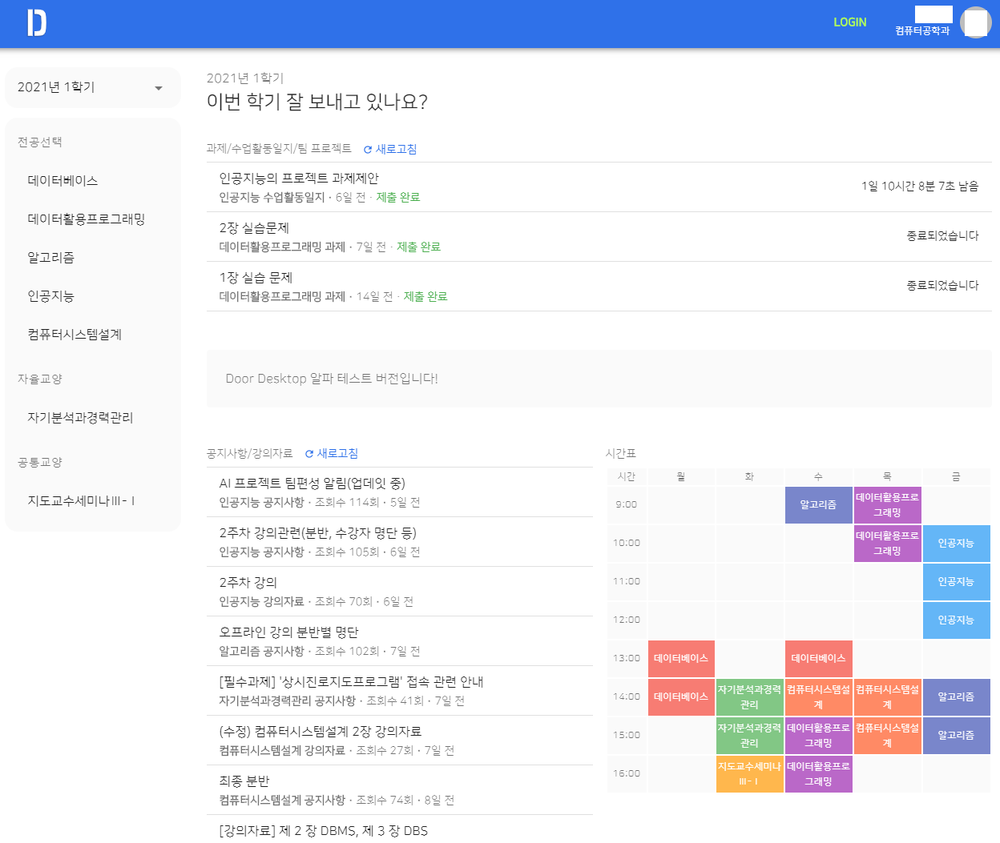 | 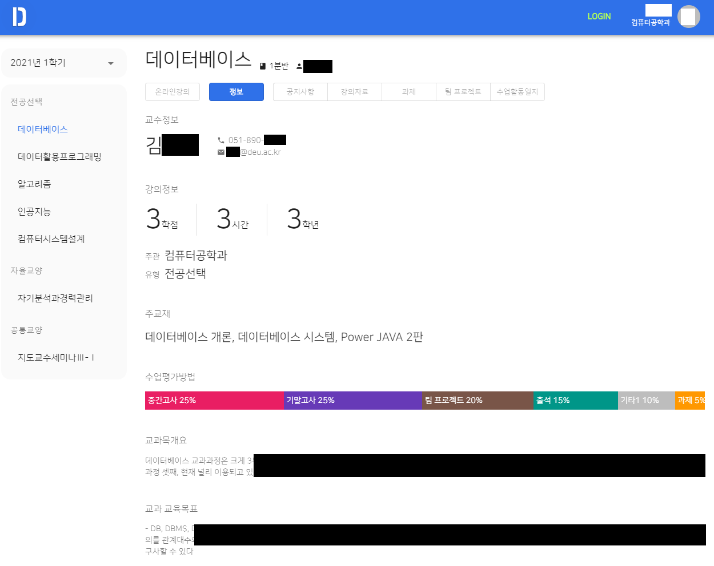 |

  

# 📢 현재 지속적으로 개발중인 프로젝트입니다.

  

# 주요 기능

### ✨ 게시물 로딩 때문에 더 이상 스트레스 받을 필요가 없습니다.

모든 페이지들은 저장되며 굳이 긴 로딩 시간을 한번 더 기다릴 필요가 없습니다.

### 😥 매번 로그인으로 스트레스 받지 마세요.

자동 로그인 및 자동 로그아웃 방지 기능이 탑재되어있어 매번 아이디와 비밀번호를 입력하지 않아도 됩니다.

### 📲 더 나은 사용자 경험 제공

기존의 불편한 인터페이스는 잊어버리세요. Material UI로 제작된 이 애플리케이션은 최신 디자인 트렌드를 반영하였습니다.

또한 사용자 경험을 우선시하여 불필요한 동작 및 클릭을 많이 줄였습니다.

### 🧲 게시판마다 새 게시물을 하나하나 확인하는건 그만!

메인 화면에서 모든 게시판의 게시물을 모아서 보여줍니다.

 

# 목차

1. [소개](#소개)
    1. [이 프로젝트는 무엇인가요?](#이-프로젝트는-무엇인가요)
    2. [왜 이런 프로젝트를 시작했나요?](#왜-이런-프로젝트를-시작했나요)
    3. [기존 Door보다 어떤 점이 더 좋나요?](#기존-door보다-어떤-점이-더-좋나요)
2. [설치](#설치)
3. [Door 기능 지원 현황](#door-기능-지원-현황)
4. [기존 Door와 비교](#기존-door와-비교)
5. [개발자들을 위한 정보](#개발자들을-위한-정보)
    1. [프로젝트 테스트 및 빌드](#프로젝트-테스트-및-빌드)
    2. [Typed models](#typed-models)
    3. [통신 구조](#통신-구조)
    4. [How to store password to local securely](#how-to-store-password-to-local-securely)

  

# 소개

## 이 프로젝트는 무엇인가요?

동의대학교 Door 홈페이지의 불편한 점을 개선하는 데스크탑 앱 프로젝트입니다.

 

## 왜 이런 프로젝트를 시작했나요?

기존의 Door 홈페이지는 매우 느립니다. 서버가 느린 것도 있지만 원하는 정보를 얻는 데 걸리는 시간도 말이죠. 사용자가 알아야 할 정보들이 여기저기 흩어져 있고, 한눈에 이해하기 힘들게 표시되어 있는 정보들이 많습니다. 사용자들이 새 게시물이 올라왔는지 확인하거나 완료하지 못한 과제가 있는지, 또 과제 마감까지 얼마나 남았는지 확인하기 위해선 곳곳에 흩어져 있는 게시물 목록들을 하나하나 클릭하여 확인해야 합니다.

이 프로젝트는 이런 불편한 점들을 개선하기 위해 시작하였습니다. 사용자 경험(UX) 측면에서, 사용자가 원하는 정보를 어떻게 적절하게 표시할 지, 또 불필요한 클릭을 어떻게 줄일 수 있을 지, 해당 정보엔 어떤 색이 적절한지 등 많은 부분을 고민하여 제작하였습니다.

  

## 기존 Door보다 어떤 점이 더 좋나요?

##### 한번 열었던 게시물은 모두 저장됩니다.

다음 번에 한번 더 클릭했을 때 빠르게 보여주기 위해서죠. 사용자 측에서 보기엔 두 번째 클릭부터 로딩시간이 아예 없는 것처럼 느껴질 겁니다.

##### 자동 로그인으로 불필요하게 로그인하는 과정을 없앴습니다.

##### Material UI를 채택하여 깔끔하고 직관적인 UI를 만들었습니다.

##### 메인 화면에서 모든 게시물을 모아서 볼 수 있습니다.

새로고침 버튼 하나면 프로그램이 각 게시판마다 게시물을 가져와 보여줍니다. 이제 새 게시물을 확인하느라 진땀빼지 않아도 되요.

##### 제출이 필요한 게시물은 제출 기한이 얼마나 남았는지 보여줘요.

`2021년 3월 19일 23:59까지` 처럼 불편한 포맷 대신, `2일 1시간 2분 50초 남음` 같이 얼마나 남았는지를 표시해준답니다. 마우스를 올리면 기존과 같은 포맷으로 보여주기도 해요.

##### 제출 여부를 더 직관적으로.

제출 완료한 게시물은 초록색으로 표시해줍니다. 아직 제출하지 못한 게시물은 빨간색으로 표시되니, 제출 여부를 더 직관적으로 알 수 있어요.

##### 온라인 강의, 더 직관적이고 진행 여부를 알기 쉽게!

강의를 들으면 얼마나 들었는지 진행 바로 표시해줘요. 기존 Door 홈페이지는 별도의 페이지에 숫자로만 표시되었는데 이 프로그램에선 한 페이지에, 한 눈에 알 수 있게 표시해줘요.

##### 수업에 대한 정보, 이젠 한 눈에 바로 알 수 있어요.

기존 Door에선 모든 정보들이 표에 똑같은 글자 크기 및 색깔로 나열되어있어서 중요한 정보가 눈에 잘 들어오지 않았어요. 이 프로그램은 유사한 정보끼리 잘 묶었으며 정보에 따라 적절한 시각화를 채택하여 더 직관적으로 이해할 수 있답니다.

  

# 설치

이 프로젝트는 데스크탑 앱으로 제공됩니다. 현재 Windows 10 플랫폼만 지원하며 Mac OS (Intel, M1), Linux는 추후 지원할 예정입니다.

**[Releases](https://github.com/deu-door/door-desktop/releases)** 에서 최신 버전을 확인하세요!

설치 가능한 바이너리 파일(exe 등)이 제공됩니다. 클릭하신 후 설치 진행하시면 됩니다.

  

# Door 기능 지원 현황

<table>
    <thead>
        <tr>
            <th>분류</th>
            <th>기능</th>
            <th>지원 여부</th>
        </tr>
    </thead>
    <tbody>
        <tr>
            <td rowspan="3">주요기능</td>
            <td>정규과정 강의</td>
            <td>O</td>
        </tr>
        <tr>
            <td>D-MOOC</td>
            <td>X</td>
        </tr>
        <tr>
            <td>쪽지</td>
            <td>X</td>
        </tr>
        <tr>
            <td rowspan="4">온라인강의</td>
            <td>수강</td>
            <td>O</td>
        </tr>
        <tr>
            <td>출석 확인</td>
            <td>O</td>
        </tr>
        <tr>
            <td>출석 기록</td>
            <td>O</td>
        </tr>
        <tr>
            <td>학습 시간 확인</td>
            <td>O</td>
        </tr>
        <tr>
            <td rowspan="1">DOOR</td>
            <td>DOOR 열람</td>
            <td>지원 예정</td>
        </tr>
        <tr>
            <td rowspan="4">수업계획서</td>
            <td>수업 정보 조회</td>
            <td>O</td>
        </tr>
        <tr>
            <td>수업 평가 방법</td>
            <td>O</td>
        </tr>
        <tr>
            <td>참여도 세부 비율 확인</td>
            <td>X</td>
        </tr>
        <tr>
            <td>주차별 강의계획</td>
            <td>X</td>
        </tr>
        <tr>
            <td rowspan="5">과제</td>
            <td>열람 및 첨부파일 다운</td>
            <td>O</td>
        </tr>
        <tr>
            <td>제출</td>
            <td>O</td>
        </tr>
        <tr>
            <td>제출기간 확인</td>
            <td>O</td>
        </tr>
        <tr>
            <td>추가 제출기간 확인</td>
            <td>O</td>
        </tr>
        <tr>
            <td>평가 정보</td>
            <td>지원 예정</td>
        </tr>
        <tr>
            <td rowspan="5">수업활동일지</td>
            <td>열람 및 첨부파일 다운</td>
            <td>O</td>
        </tr>
        <tr>
            <td>제출</td>
            <td>O</td>
        </tr>
        <tr>
            <td>제출기간 확인</td>
            <td>O</td>
        </tr>
        <tr>
            <td>추가 제출기간 확인</td>
            <td>O</td>
        </tr>
        <tr>
            <td>평가 정보</td>
            <td>지원 예정</td>
        </tr>
        <tr>
            <td rowspan="4">팀 프로젝트 결과</td>
            <td>열람 및 첨부파일 다운</td>
            <td>O</td>
        </tr>
        <tr>
            <td>제출</td>
            <td>O</td>
        </tr>
        <tr>
            <td>제출기간 확인</td>
            <td>O</td>
        </tr>
        <tr>
            <td>팀 편성 확인</td>
            <td>지원 예정</td>
        </tr>
        <tr>
            <td rowspan="2">공지사항</td>
            <td>열람 및 첨부파일 다운</td>
            <td>O</td>
        </tr>
        <tr>
            <td>읽음 여부 확인</td>
            <td>O</td>
        </tr>
        <tr>
            <td rowspan="2">강의자료</td>
            <td>열람 및 첨부파일 다운</td>
            <td>O</td>
        </tr>
        <tr>
            <td>읽음 여부 확인</td>
            <td>O</td>
        </tr>
        <tr>
            <td rowspan="6">기타</td>
            <td>퀴즈</td>
            <td>X</td>
        </tr>
        <tr>
            <td>토론</td>
            <td>X</td>
        </tr>
        <tr>
            <td>Q&A</td>
            <td>X</td>
        </tr>
        <tr>
            <td>1:1 교수 상담</td>
            <td>X</td>
        </tr>
        <tr>
            <td>팀별 게시판</td>
            <td>X</td>
        </tr>
        <tr>
            <td>멘토링 게시판</td>
            <td>X</td>
        </tr>
    </tbody>
</table>

  

# 기존 Door와 비교

|                      기존 Door                       |                       Door Desktop                        |
| :--------------------------------------------------: | :-------------------------------------------------------: |
|      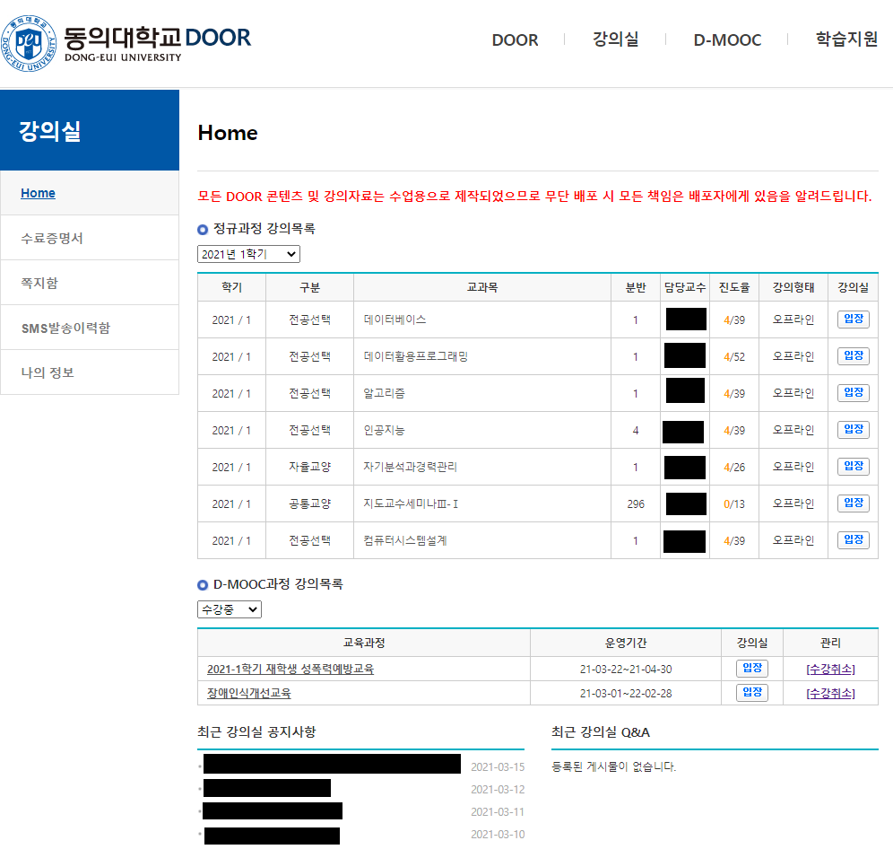      |          |
|      |      |
|     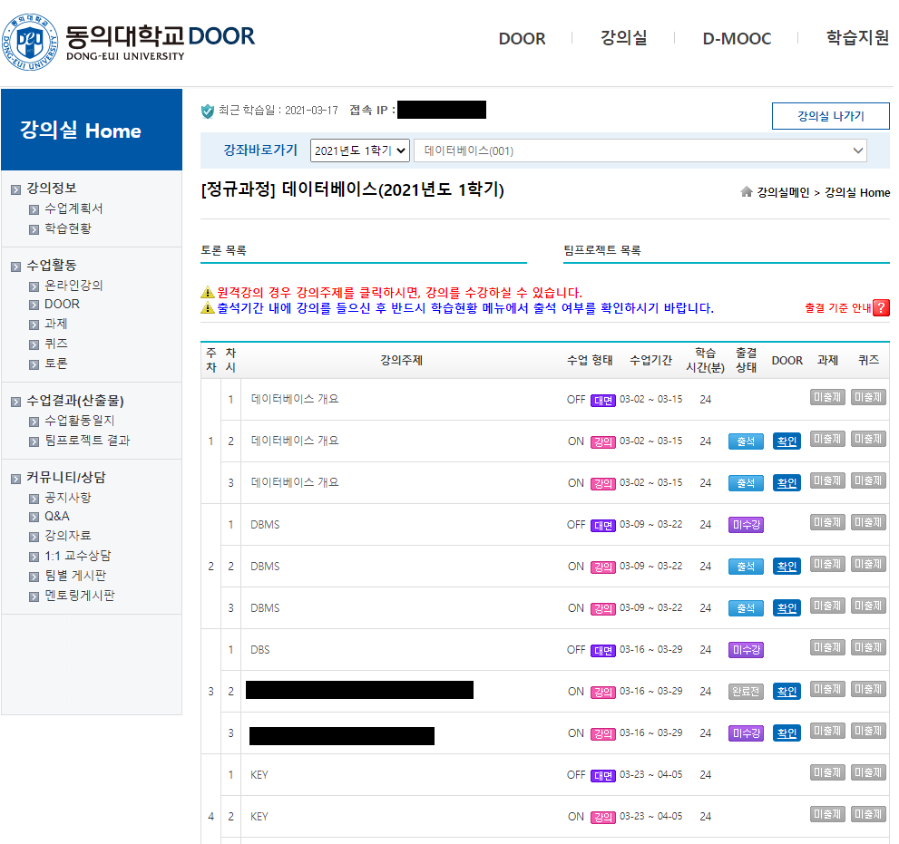      |     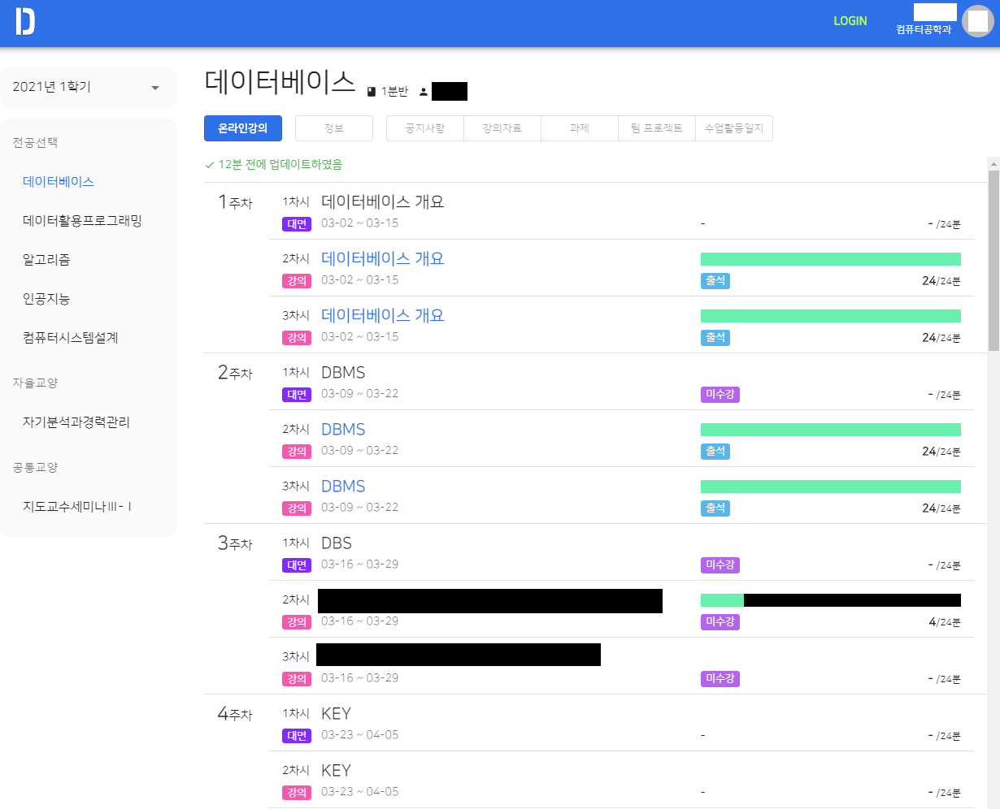      |
| 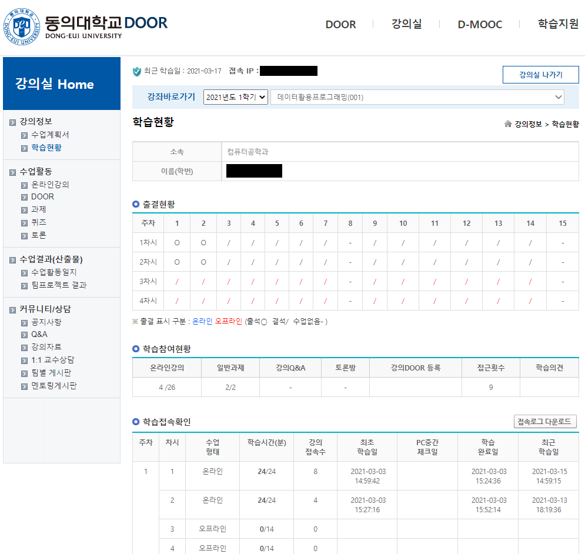  |                    위 쪽 화면에 통합됨                    |
|      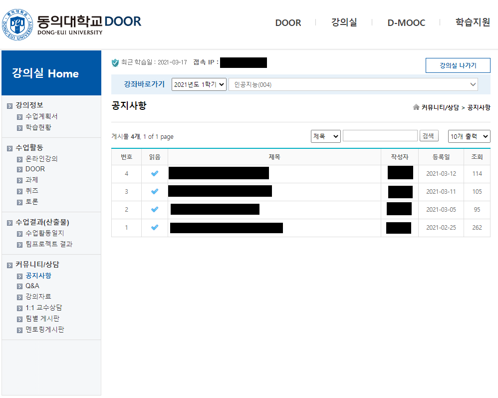      |      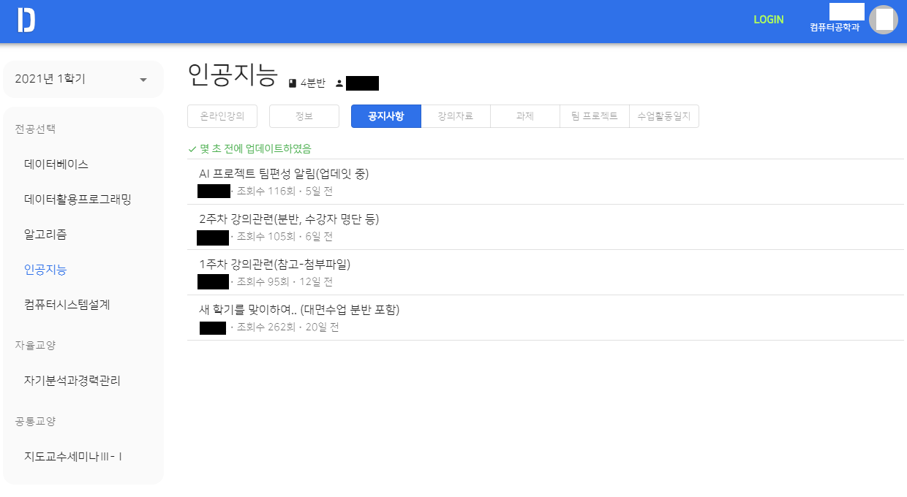      |
|    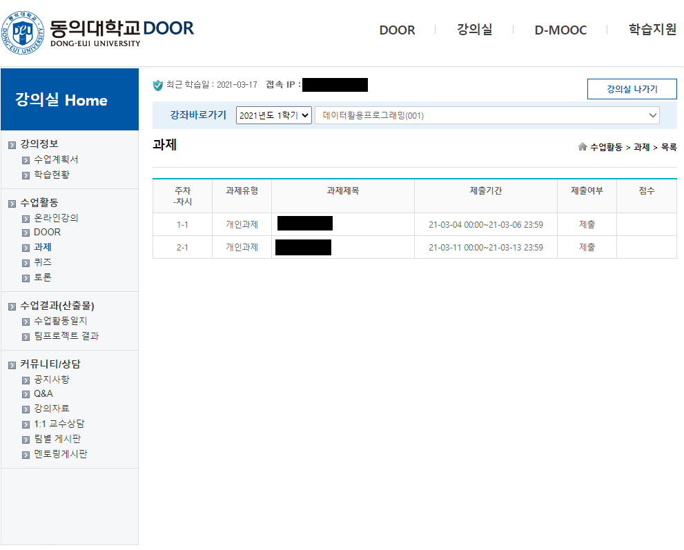    |        |
| 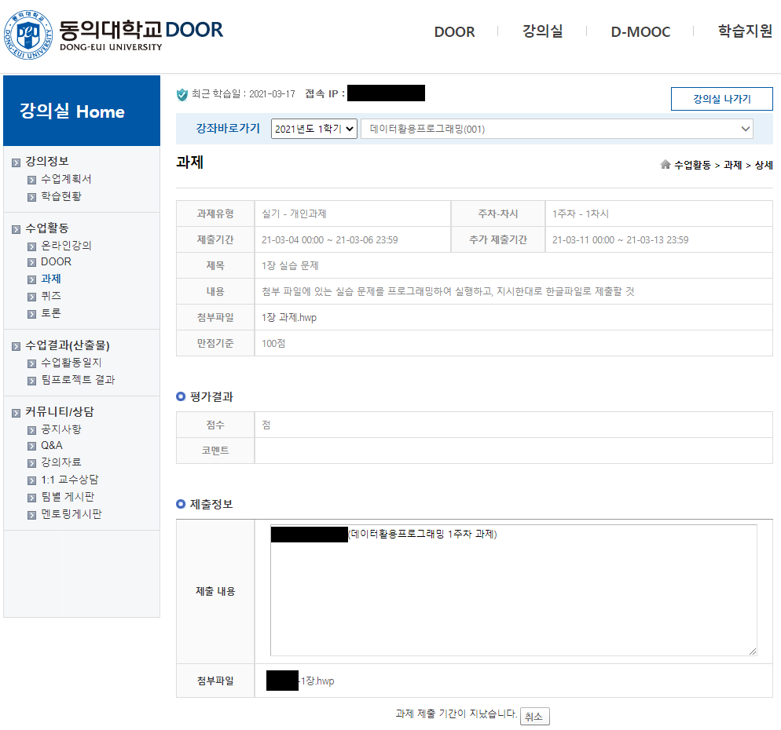 | 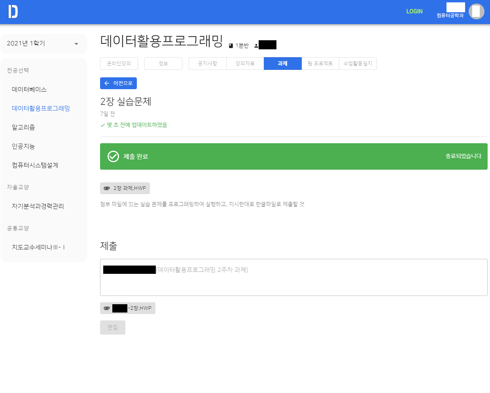 |
|    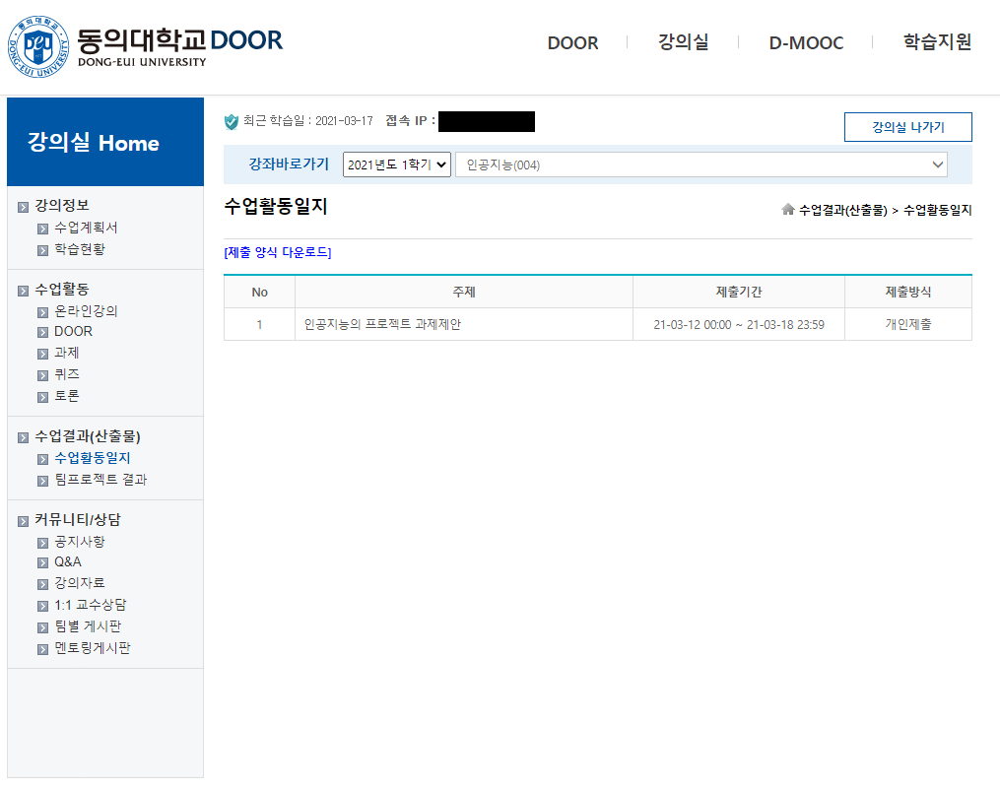     |    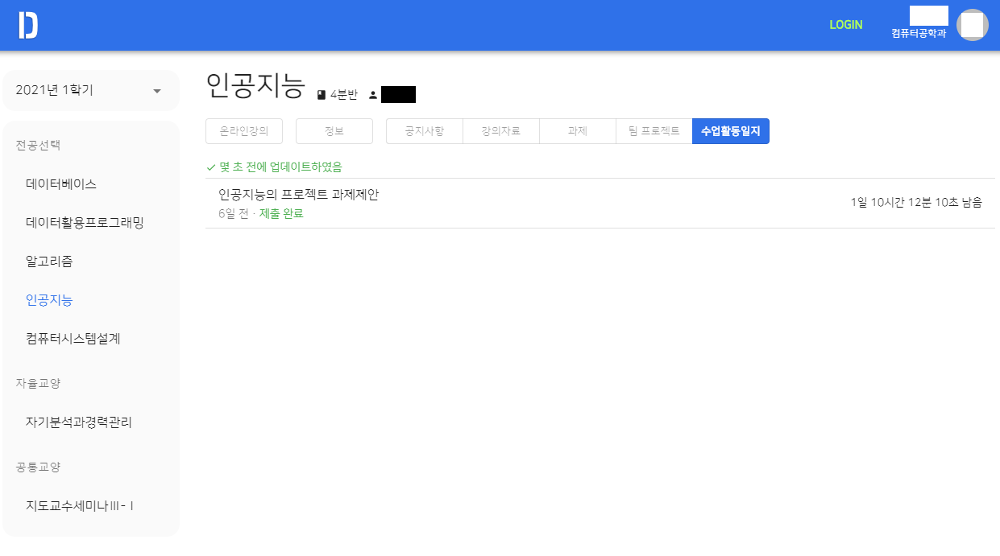     |

  

# 개발자들을 위한 정보

## 프로젝트 테스트 및 빌드

이 프로젝트는 `yarn` 패키지 관리자를 사용하고 있습니다.

-   **`yarn start`** 즉석으로 테스트하는 스크립트입니다.
-   **`yarn build`** 설치 가능한 바이너리 파일을 빌드하는 스크립트입니다.

 

## 프로젝트에 사용된 기술 스택

##### [Typescript](https://www.typescriptlang.org/)

Javacript에 강력한 타입 검사가 추가된 언어입니다. 중/대규모 프로젝트에서 실수를 많이 줄여주며 개발 기간 단축에 큰 도움이 되었습니다.

##### [React](https://reactjs.org/)

복잡한 상태 관리를 편리하게 할 수 있는 프레임워크. 중구난방이 될 수도 있는 상태 관리를 React 덕분에 깔끔하게 할 수 있었습니다.

##### [Electron](https://www.electronjs.org/)

웹을 데스크탑 앱으로 만들어 주는 라이브러리입니다.

##### [Material UI](https://material-ui.com/)

미려한 UI 컴포넌트들을 제공해주는 라이브러리입니다. 덕분에 깔끔한 UI를 만들 수 있었습니다.

##### [Redux](https://redux.js.org/)

종합적인 상태 관리를 도와주는 라이브러리입니다. 주로 `Redux toolkit` 을 사용하여 상태를 관리하였습니다.

 

## Typed models

각 Object들에 대해 Type들을 명시해두었고 이를 내부적으로 `model` 이라고 부릅니다.

당장 문서로 작성하는 것은 어려우니 **[src/models/door](https://github.com/deu-door/door-desktop/tree/master/src/models/door)** 디렉토리를 참고해주세요.

 

## 통신 구조

이 프로그램은 별도의 서버 없이 Door 홈페이지와 직접 통신합니다. Door 홈페이지에서 받은 html을 파싱하여 적절한 정보로 가공한 후 프로그램에서 사용합니다.

 

## How to store password to local securely

This section describes about "how to securely save user's credential to local storage". Please note, how this logic is secure is depends on `OS keychain` system.

Once user checked `auto-login`, program encrypts password with symmetric encryption algorithm: `AES-256-CBC`. Encrypted password is splited to two parts, `key with iv` and `encrypted password by algorithm`. The former is stored in the `OS keychain` and latter is stored in the `AppData`. Delete either of them, it cannot be decrypted.
