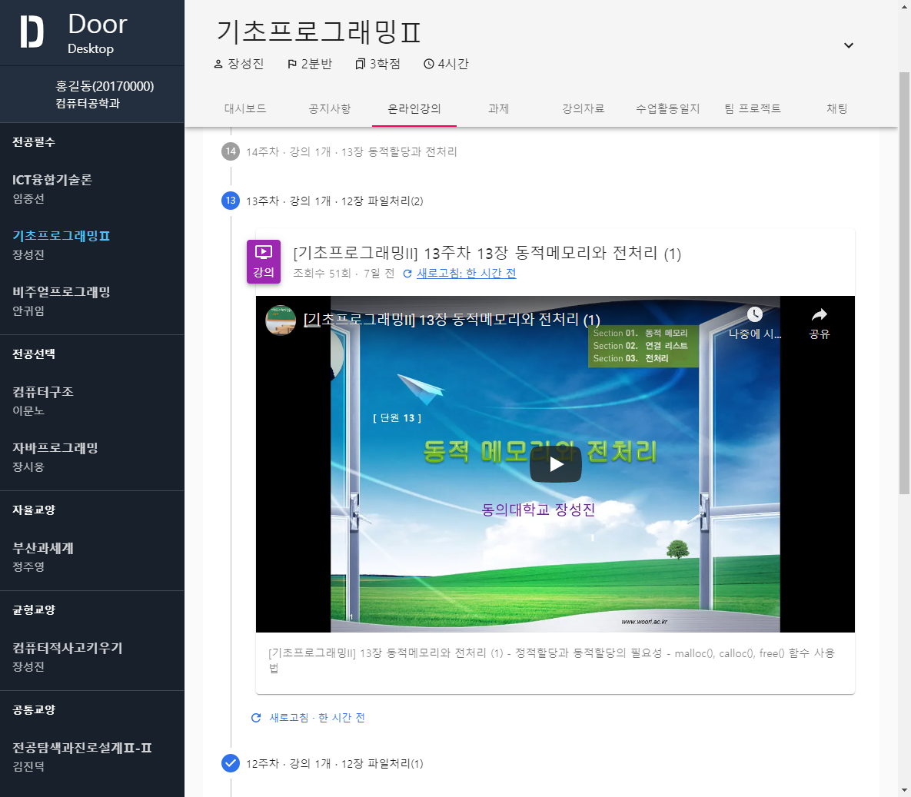
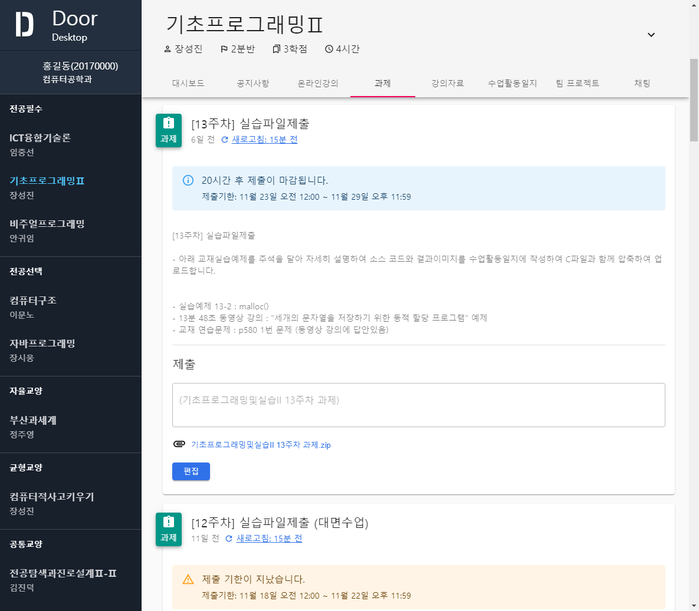

<p align="center"></p>
<h1 align="center">Door Desktop</h1>
<p align="center">
Better way to join online classes, In <strong><a href="http://door.deu.ac.kr">Dong-eui University</a></strong>
</p>

<br><br>

# 📢 현재 지속적으로 개발중인 프로젝트입니다.

<br>

# 주요 기능

### ✨ 게시물 로딩 때문에 더 이상 스트레스 받을 필요가 없습니다.
모든 페이지들은 저장되며 굳이 긴 로딩 시간을 한번 더 기다릴 필요가 없습니다.

### 😥 매번 로그인으로 스트레스 받지 마세요.
자동 로그인 및 자동 로그아웃 방지 기능이 탑재되어있어 매번 아이디와 비밀번호를 입력하지 않아도 됩니다.

### 📲 더 나은 사용자 경험 제공
기존의 불편한 인터페이스는 잊어버리세요. Material UI로 제작된 이 애플리케이션은 최신 디자인 트렌드를 반영하였습니다.

또한 사용자 경험을 우선시하여 불필요한 동작 및 클릭을 많이 줄였습니다.

### 🧲 게시물을 하나하나 확인할 필요가 있을까요?
스크롤만 쓱 한번 내리면 게시물의 내용이 자동으로 로딩됩니다.

<br>

# 갤러리

|||
|:-:|:-:|
|**대시보드**|**강의 시청**|

|||
|:-:|:-:|
|**과제**|**강의 자료**|

|||
|:-:|:-:|
|**게시물 자동 로딩**|**로딩 후**|

<br>

# 프로젝트에 사용된 기술 스택

* **[Typescript](https://www.typescriptlang.org/)**
* **[React](https://reactjs.org/)**
* **[Electron](https://www.electronjs.org/)**
* **[Material UI](https://material-ui.com/)**
* **[Redux](https://redux.js.org/)**

<br>

# 프로젝트 테스트 및 빌드
이 프로젝트는 `yarn` 패키지 관리자를 사용하고 있습니다.

### 테스트
```bash
$ yarn start
```

### 빌드
```bash
$ yarn build
```
