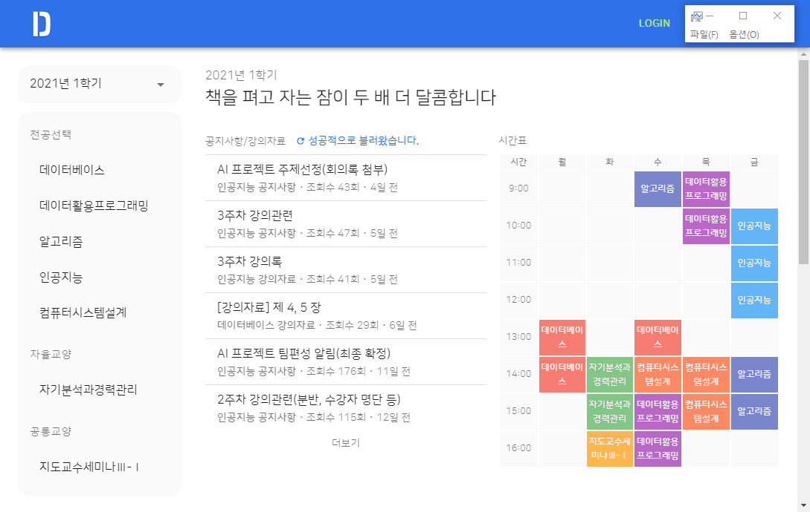
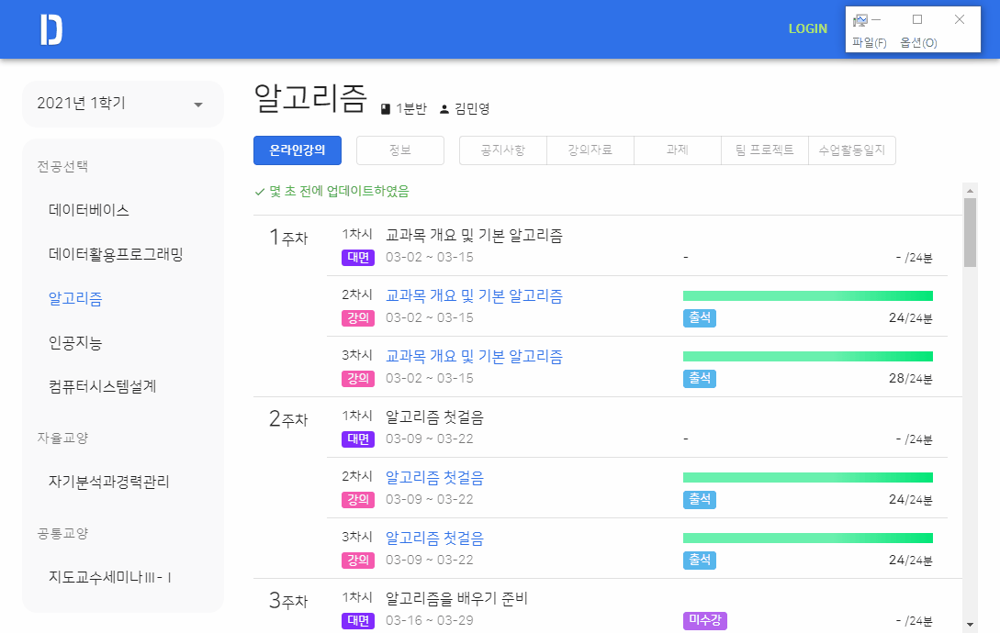

<h1 align="center">Door Desktop</h1>

Better way to join online classes, In <strong><a href="http://door.deu.ac.kr">Dong-eui University</a></strong>

  

  

<table>
<tbody>
<tr>
<td>
이 레포지토리는 GUI 소스코드만 제공하고 있습니다. door 서비스에서 데이터를 가져오는 등의 통신을 하는 코드는 제외되어 있습니다. 자세한 내용은 <a href="#5-3-프로젝트-구성">여기</a>를 참고해주세요.
</td>
</tr>
</tbody>
</table>

  

<h1>주요 기능</h1>

<h3>✨ 게시물 로딩 때문에 더 이상 스트레스 받을 필요가 없습니다.</h3>

모든 페이지들은 저장되며 굳이 긴 로딩 시간을 한번 더 기다릴 필요가 없습니다.

<h3>😥 매번 로그인으로 스트레스 받지 마세요.</h3>

자동 로그인 및 자동 로그아웃 방지 기능이 탑재되어있어 매번 아이디와 비밀번호를 입력하지 않아도 됩니다.

<h3>📲 더 나은 사용자 경험 제공</h3>

기존의 불편한 인터페이스는 잊어버리세요. Material UI로 제작된 이 애플리케이션은 최신 디자인 트렌드를 반영하였습니다.

또한 사용자 경험을 우선시하여 불필요한 동작 및 클릭을 많이 줄였습니다.

<h3>🧲 게시판마다 새 게시물을 하나하나 확인하는건 그만!</h3>

메인 화면에서 모든 게시판의 게시물을 모아서 보여줍니다.

  

<h1>다운로드 기록</h1>

-   2021년 3월 23일 **첫 릴리즈 (v0.3.4)**
-   2021년 3월 28일 **200+**

  

<h1>목차</h1>

<!-- @import "[TOC]" {cmd="toc" depthFrom=1 depthTo=6 orderedList=false} -->

- [1. 소개](#1-소개)
  - [이 프로젝트는 무엇인가요?](#이-프로젝트는-무엇인가요)
  - [1-1. 왜 이런 프로젝트를 시작했나요?](#1-1-왜-이런-프로젝트를-시작했나요)
  - [1-2. 기존 Door보다 어떤 점이 더 좋나요?](#1-2-기존-door보다-어떤-점이-더-좋나요)
- [2. 설치](#2-설치)
- [3. Door 기능 지원 현황](#3-door-기능-지원-현황)
- [4. 기존 Door와 비교](#4-기존-door와-비교)
  - [4-1. 메인 화면](#4-1-메인-화면)
  - [4-2. 수업계획서 화면](#4-2-수업계획서-화면)
  - [4-3. 온라인강의 목록 화면](#4-3-온라인강의-목록-화면)
  - [4-3. 온라인강의 진행상태 화면](#4-3-온라인강의-진행상태-화면)
  - [4-4. 공지사항 게시물 목록 화면](#4-4-공지사항-게시물-목록-화면)
  - [4-5. 과제 게시물 목록 화면](#4-5-과제-게시물-목록-화면)
  - [4-6. 과제 게시물 화면](#4-6-과제-게시물-화면)
  - [4-7. 수업활동일지 게시물 목록 화면](#4-7-수업활동일지-게시물-목록-화면)
- [5. 개발자들을 위한 정보](#5-개발자들을-위한-정보)
  - [5-1. 프로젝트 테스트 또는 빌드](#5-1-프로젝트-테스트-또는-빌드)
  - [5-2. 프로젝트에 사용된 기술 스택](#5-2-프로젝트에-사용된-기술-스택)
  - [5-3. 프로젝트 구성](#5-3-프로젝트-구성)
  - [5-4. 프로그램 통신 개요](#5-4-프로그램-통신-개요)
  - [5-5. 프로그램 IPC 통신 구조](#5-5-프로그램-ipc-통신-구조)
  - [5-6. How to store password to local securely](#5-6-how-to-store-password-to-local-securely)

  

# 1. 소개

## 이 프로젝트는 무엇인가요?

동의대학교 Door 홈페이지의 불편한 점을 개선하는 데스크탑 앱 프로젝트입니다.

 

## 1-1. 왜 이런 프로젝트를 시작했나요?

기존의 Door 홈페이지는 매우 느립니다. 서버가 느린 것도 있지만 원하는 정보를 얻는 데 걸리는 시간도 말이죠. 사용자가 알아야 할 정보들이 여기저기 흩어져 있고, 한눈에 이해하기 힘들게 표시되어 있는 정보들이 많습니다. 사용자들이 새 게시물이 올라왔는지 확인하거나 완료하지 못한 과제가 있는지, 또 과제 마감까지 얼마나 남았는지 확인하기 위해선 곳곳에 흩어져 있는 게시물 목록들을 하나하나 클릭하여 확인해야 합니다.

이 프로젝트는 이런 불편한 점들을 개선하기 위해 시작하였습니다. 사용자 경험(UX) 측면에서, 사용자가 원하는 정보를 어떻게 적절하게 표시할 지, 또 불필요한 클릭을 어떻게 줄일 수 있을 지, 해당 정보엔 어떤 색이 적절한지 등 많은 부분을 고민하여 제작하였습니다.

  

## 1-2. 기존 Door보다 어떤 점이 더 좋나요?

**한번 열었던 게시물은 모두 저장됩니다.**

다음 번에 한번 더 클릭했을 때 빠르게 보여주기 위해서죠. 사용자 측에서 보기엔 두 번째 클릭부터 로딩시간이 아예 없는 것처럼 느껴질 겁니다.

 

**자동 로그인으로 불필요하게 로그인하는 과정을 없앴습니다.**

 

**Material UI를 채택하여 깔끔하고 직관적인 UI를 만들었습니다.**

 

**메인 화면에서 모든 게시물을 모아서 볼 수 있습니다.**

새로고침 버튼 하나면 프로그램이 각 게시판마다 게시물을 가져와 보여줍니다. 이제 새 게시물을 확인하느라 진땀빼지 않아도 되요.

 

**제출이 필요한 게시물은 제출 기한이 얼마나 남았는지 보여줘요.**

`2021년 3월 19일 23:59까지` 처럼 불편한 포맷 대신, `2일 1시간 2분 50초 남음` 같이 얼마나 남았는지를 표시해준답니다. 마우스를 올리면 기존과 같은 포맷으로 보여주기도 해요.

 

**제출 여부를 더 직관적으로.**

제출 완료한 게시물은 초록색으로 표시해줍니다. 아직 제출하지 못한 게시물은 빨간색으로 표시되니, 제출 여부를 더 직관적으로 알 수 있어요.

 

**온라인 강의, 더 직관적이고 진행 여부를 알기 쉽게!**

강의를 들으면 얼마나 들었는지 진행 바로 표시해줘요. 기존 Door 홈페이지는 별도의 페이지에 숫자로만 표시되었는데 이 프로그램에선 한 페이지에, 한 눈에 알 수 있게 표시해줘요.

 

**수업에 대한 정보, 이젠 한 눈에 바로 알 수 있어요.**

기존 Door에선 모든 정보들이 표에 똑같은 글자 크기 및 색깔로 나열되어있어서 중요한 정보가 눈에 잘 들어오지 않았어요. 이 프로그램은 유사한 정보끼리 잘 묶었으며 정보에 따라 적절한 시각화를 채택하여 더 직관적으로 이해할 수 있답니다.

  

# 2. 설치

~~이 프로젝트는 데스크탑 앱으로 제공됩니다. 현재 Windows 10 운영체제만 지원합니다.~~

~~**[Releases](https://github.com/deu-door/door-desktop/releases)** 에서 최신 버전을 확인하세요!~~

~~설치 가능한 바이너리 파일(exe 등)이 제공됩니다. 클릭하신 후 설치 진행하시면 됩니다.~~

> 학교 측의 요청으로 Release는 더 이상 제공되지 않습니다.

  

# 3. Door 기능 지원 현황

<table>
    <thead>
        <tr>
            <th>분류</th>
            <th>기능</th>
            <th>지원 여부</th>
        </tr>
    </thead>
    <tbody>
        <tr>
            <td rowspan="3">주요기능</td>
            <td>정규과정 강의</td>
            <td>O</td>
        </tr>
        <tr>
            <td>D-MOOC</td>
            <td>X</td>
        </tr>
        <tr>
            <td>쪽지</td>
            <td>X</td>
        </tr>
        <tr>
            <td rowspan="4">온라인강의</td>
            <td>수강</td>
            <td>O</td>
        </tr>
        <tr>
            <td>출석 확인</td>
            <td>O</td>
        </tr>
        <tr>
            <td>출석 기록</td>
            <td>O</td>
        </tr>
        <tr>
            <td>학습 시간 확인</td>
            <td>O</td>
        </tr>
        <tr>
            <td rowspan="1">DOOR</td>
            <td>DOOR 열람</td>
            <td>X</td>
        </tr>
        <tr>
            <td rowspan="4">수업계획서</td>
            <td>수업 정보 조회</td>
            <td>O</td>
        </tr>
        <tr>
            <td>수업 평가 방법</td>
            <td>O</td>
        </tr>
        <tr>
            <td>참여도 세부 비율 확인</td>
            <td>X</td>
        </tr>
        <tr>
            <td>주차별 강의계획</td>
            <td>X</td>
        </tr>
        <tr>
            <td rowspan="5">과제</td>
            <td>열람 및 첨부파일 다운</td>
            <td>O</td>
        </tr>
        <tr>
            <td>제출</td>
            <td>O</td>
        </tr>
        <tr>
            <td>제출기간 확인</td>
            <td>O</td>
        </tr>
        <tr>
            <td>추가 제출기간 확인</td>
            <td>O</td>
        </tr>
        <tr>
            <td>평가 정보</td>
            <td>O</td>
        </tr>
        <tr>
            <td rowspan="5">수업활동일지</td>
            <td>열람 및 첨부파일 다운</td>
            <td>O</td>
        </tr>
        <tr>
            <td>제출</td>
            <td>O</td>
        </tr>
        <tr>
            <td>제출기간 확인</td>
            <td>O</td>
        </tr>
        <tr>
            <td>추가 제출기간 확인</td>
            <td>O</td>
        </tr>
        <tr>
            <td>평가 정보</td>
            <td>O</td>
        </tr>
        <tr>
            <td rowspan="4">팀 프로젝트 결과</td>
            <td>열람 및 첨부파일 다운</td>
            <td>O</td>
        </tr>
        <tr>
            <td>제출</td>
            <td>O</td>
        </tr>
        <tr>
            <td>제출기간 확인</td>
            <td>O</td>
        </tr>
        <tr>
            <td>팀 편성 확인</td>
            <td>X</td>
        </tr>
        <tr>
            <td rowspan="2">공지사항</td>
            <td>열람 및 첨부파일 다운</td>
            <td>O</td>
        </tr>
        <tr>
            <td>읽음 여부 확인</td>
            <td>O</td>
        </tr>
        <tr>
            <td rowspan="2">강의자료</td>
            <td>열람 및 첨부파일 다운</td>
            <td>O</td>
        </tr>
        <tr>
            <td>읽음 여부 확인</td>
            <td>O</td>
        </tr>
        <tr>
            <td rowspan="6">기타</td>
            <td>퀴즈</td>
            <td>X</td>
        </tr>
        <tr>
            <td>토론</td>
            <td>X</td>
        </tr>
        <tr>
            <td>Q&A</td>
            <td>X</td>
        </tr>
        <tr>
            <td>1:1 교수 상담</td>
            <td>X</td>
        </tr>
        <tr>
            <td>팀별 게시판</td>
            <td>X</td>
        </tr>
        <tr>
            <td>멘토링 게시판</td>
            <td>X</td>
        </tr>
    </tbody>
</table>

  

# 4. 기존 Door와 비교

## 4-1. 메인 화면

|                 기존 Door                  |                   Door Desktop                    |
| :----------------------------------------: | :-----------------------------------------------: |
|  |  |

 

## 4-2. 수업계획서 화면

|                    기존 Door                     |                     Door Desktop                      |
| :----------------------------------------------: | :---------------------------------------------------: |
|  |  |

 

## 4-3. 온라인강의 목록 화면

|                  기존 Door                  |                   Door Desktop                   |
| :-----------------------------------------: | :----------------------------------------------: |
|  |  |

 

## 4-3. 온라인강의 진행상태 화면

|                      기존 Door                      |         Door Desktop          |
| :-------------------------------------------------: | :---------------------------: |
|  | 온라인강의 목록 화면에 통합됨 |

 

## 4-4. 공지사항 게시물 목록 화면

|                 기존 Door                  |                  Door Desktop                   |
| :----------------------------------------: | :---------------------------------------------: |
|  |  |

 

## 4-5. 과제 게시물 목록 화면

|                   기존 Door                    |                    Door Desktop                     |
| :--------------------------------------------: | :-------------------------------------------------: |
|  |  |

 

## 4-6. 과제 게시물 화면

|                      기존 Door                       |                       Door Desktop                        |
| :--------------------------------------------------: | :-------------------------------------------------------: |
|  |  |

 

## 4-7. 수업활동일지 게시물 목록 화면

|                   기존 Door                   |                    Door Desktop                    |
| :-------------------------------------------: | :------------------------------------------------: |
|  |  |

  

# 5. 개발자들을 위한 정보

## 5-1. 프로젝트 테스트 또는 빌드

이 프로젝트는 `yarn` 패키지 관리자를 사용하고 있습니다. 테스팅 및 빌드, 패키징은 `electron-forge` 를 사용합니다.

-   **`yarn start`**
    -   즉석으로 테스트하는 스크립트입니다. `electron-forge start --inspect-electron` 명령어가 실행되며, Hot Reload가 적용되어 테스트 중에 소스코드를 수정하면 즉석으로 반영됩니다.
    -   main process는 chrome에서 `chrome://inspect` 를 통해 DevTools를 사용할 수 있습니다. 자세한 내용은 [https://www.electronjs.org/docs/tutorial/debugging-main-process](https://www.electronjs.org/docs/tutorial/debugging-main-process1) 를 참고해주세요.
-   **`yarn package`**
    -   소스코드를 실행 가능한 바이너리 파일(예: .exe)을 빌드하는 스크립트입니다.
-   **`yarn make`**
    -   설치 가능한 파일을 생성하는 스크립트입니다.
-   **`yarn lint`**
    -   eslint 및 prettier를 실행하여 문법과 코드 스타일을 검사합니다.

 

## 5-2. 프로젝트에 사용된 기술 스택

**[Electron](https://www.electronjs.org/)**

웹을 데스크탑 앱으로 만들어 주는 라이브러리입니다.

**[Typescript](https://www.typescriptlang.org/)**

Javacript에 강력한 타입 검사가 추가된 언어입니다. 중/대규모 프로젝트에서 실수를 많이 줄여주며 개발 기간 단축에 큰 도움이 되었습니다.

**[React](https://reactjs.org/)**

복잡한 상태 관리를 편리하게 할 수 있는 프레임워크. 중구난방이 될 수도 있는 상태 관리를 React 덕분에 깔끔하게 할 수 있었습니다.

**[Redux](https://redux.js.org/)**

종합적인 상태 관리를 도와주는 라이브러리입니다. 주로 `Redux toolkit` 을 사용하여 상태를 관리하였습니다.

**[Material UI](https://material-ui.com/)**

Google Material Design이 적용된UI 컴포넌트들을 제공해주는 라이브러리입니다. 덕분에 깔끔한 UI를 만들 수 있었습니다.

 

## 5-3. 프로젝트 구성

`Door Desktop` 프로젝트는 [http://door.deu.ac.kr](http://door.deu.ac.kr) 과 통신하여 로그인, 로그아웃 그리고 데이터를 파싱하는 `door-api` 레포지토리와, UI 출력을 담당하는 `door-desktop` 레포지토리로 구성되어 있습니다.

학교 측에선 소스코드의 악용을 우려하여 `door-api` 레포지토리는 GitHub에서 비공개로 전환되었습니다. 따라서 UI 파트인 `door-desktop` 레포지토리만 공개가 되어있습니다.

현재 `door-api` 모듈이 제거되어 있는 상태이므로 이 레포지토리의 소스코드만 사용하여 `Door Desktop` 앱을 빌드할 수 없습니다.

 

## 5-4. 프로그램 통신 개요

이 프로그램은 별도의 외부 서버와 통신하지 않습니다. 오로지 공식 Door 홈페이지와 통신하며, 데이터는 로컬 디스크에 저장됩니다. 따라서 사용자의 데이터가 외부로 유출될 위험이 없습니다.

> Door 홈페이지 이외에 프로그램 구동에 필요한 데이터를 불러오기 위해 GitHub와 통신할 수도 있습니다. 단, 사용자 데이터를 전송하지는 않습니다.

 

## 5-5. 프로그램 IPC 통신 구조

이 섹션에서는 프로그램의 IPC (Inter-Process Communication) 통신 구조에 대해 설명합니다.

1. 프로그램이 켜지면 Main Process 의 redux store 가 초기화됩니다. Main Process 의 redux store 는 `redux-persist` 가 적용되어 있어 프로그램이 꺼질 때 상태가 저장되며, 켜질 때 저장되어 있는 상태를 불러옵니다.
2. Main Process 가 준비되면 Renderer Process 를 생성합니다. Renderer Process 는 chromium 으로 작동하며 이는 `electron` 의 핵심이라 할 수 있습니다. Renderer Process 또한 별도의 redux store 를 가지고 있습니다. Main Process 와 동일한 redux store 를 가지기 위해 Renderer Process 생성과 동시에 `getInitialStateRenderer()` 를 통하여 Main Process 의 redux store 데이터를 복사하여 가져옵니다.
3. Renderer Process 의 redux store 가 준비가 완료되면 UI를 초기화하여 창을 띄웁니다.
4. 사용자가 프로그램을 사용하면서 클릭 등의 이벤트(게시물 클릭, 게시물 목록 불러오기 등)가 발생하면 Renderer Process 에서 action 을 발행합니다. 이 때, action 은 실질적으로 데이터를 가져오는(fetch) 역할을 수행하지 않습니다. 오로지 Main Process 에 `fetch` 를 요청하는 용도로 사용됩니다.
5. Renderer Process 에서 발행된 action 은 IPC를 통해 Main Process 로 전달됩니다.
6. Main Process 는 action 을 받고 fetch할 데이터를 해석합니다.
7. Main Process 의 요구에 따라 `door-api` 모듈은 http://door.deu.ac.kr 사이트에 데이터를 요청합니다.
8. Door 사이트에선 `door-api` 의 요청에 따라 데이터(`html`)를 반환합니다. `door-api` 는 해당 `html` 을 파싱하여 `Javascript Object` 로 가공합니다.
9. `door-api`를 통해 받은 데이터를 redux store 에 전달할 수 있도록 action 으로 발행합니다. 이는 Main Process, Renderer Process 둘 다 전달됩니다. 동일한 action 을 모든 Process 에 broadcast 함으로서, Process 마다 가지고 있는 redux store 를 동일한 상태로 유지할 수 있습니다.
10. Main Process 에서 Renderer Process 로 action 을 전달할 때 `forwardToRenderer` 를 통해 전달됩니다. `forwardToMain` 의 반대입니다.

 

## 5-6. How to store password to local securely

This section describes about "how to securely save user's credential to local storage". Please note, how this logic is secure is depends on `OS keychain` system.

Once user checked `auto-login`, program encrypts password with symmetric encryption algorithm: `AES-256-CBC`. Encrypted password is splited to two parts, `key with iv` and `encrypted password by algorithm`. The former is stored in the `OS keychain` and latter is stored in the `AppData`. Delete either of them, it cannot be decrypted.
